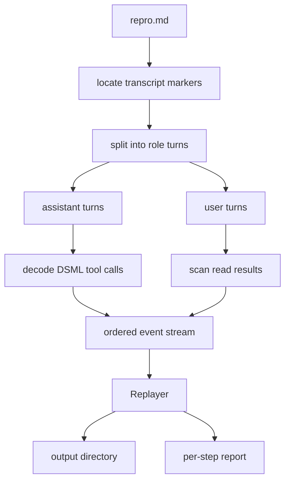
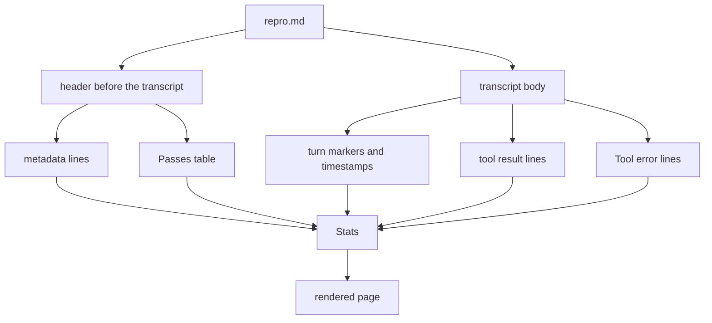

# Design

## The problem

When a `plank` session ends, plank writes a repro file into `~/.plank/repro/`. The file
is a Markdown report: a header describing the model and generation settings, a table of
generation passes, and then the exact engine transcript, verbatim, between
`----- BEGIN TRANSCRIPT -----` and `----- END TRANSCRIPT -----`.

That transcript is a complete record of what the model did, but it is a record in prose.
If a session spent an hour building a Rust project across seven `write` calls and nine
`edit` calls, the resulting files exist nowhere in the repro as files. They exist only as
a sequence of instructions that, applied in order, would produce them. Reading the repro
tells you what happened; it does not give you something you can compile.

`pt replay` closes that gap. It reads the transcript, decodes the tool calls the model
emitted, and applies them to a fresh directory, so the session's output becomes a real
tree you can build, test, diff against another run, or hand to someone else.

## The shape of the input

Inside the transcript, turns are delimited by bare role markers on their own lines:
`[system]`, `[user]`, `[assistant]`, `[tool]`. Tool calls live in assistant turns and are
written in DSML, plank's native tool dialect for DeepSeek-family models:

```
<｜DSML｜ calls>
<｜DSML｜ invoke name="write">
<｜DSML｜ parameter name="path" string="true">Cargo.toml</｜DSML｜ parameter>
<｜DSML｜ parameter name="content" string="true">[package]
name = "parola"
</｜DSML｜ parameter>
</｜DSML｜ invoke>
</｜DSML｜ calls>
```

Two details drive most of the parser's structure.

The first is that the same markup appears in the system prompt, where plank documents the
tool protocol to the model with worked examples, including a complete `edit` call against
`/tmp/example.c`. A naive scan for invocation tags would replay plank's own documentation
as if the model had requested it. So the parser tracks which role owns the current turn
and decodes calls only inside `[assistant]`.

The second is that DSML has two spellings in the wild. Repros from plank 2.x and 3.x use
the `dsml` dialect, which writes tags without a separating space and names the enclosing
block `tool_calls`. Repros from 4.x and later use `dsml41`, which adds the space and
renames the block to `calls`. Both spellings appear across a single user's repro
directory. The parser therefore never matches a fixed tag string; it strips the shared
`<｜DSML｜` prefix, tolerates an optional space, and matches the tag name that follows.
Closing tags are checked against both renderings. Without this, roughly four out of five
archived repros decode to nothing at all.

## Pipeline



Parsing and replaying are separate crates-worth of concern kept in separate modules.
`parse` turns bytes into an ordered `Vec<Event>` and touches no filesystem; `replay`
consumes that stream and performs effects. The split means the whole decoding layer is
testable against string fixtures with no temporary directories, and it means a caller
using the library can inspect or filter the event stream before anything is written.

The event stream is ordered rather than grouped by kind. That matters because a recovered
file has to be restored at the point in the session where the model first saw it, not
before the run and not after, so that a later `write` to the same path still takes
precedence in the order the session actually established.

## Replaying an edit

`write` is trivial: create parent directories, write bytes. `edit` is where fidelity
matters, because plank's `edit` tool has semantics that exist specifically to make
mistakes loud.

A plain edit carries `old` and `new`. The `old` text must occur exactly once in the
current file. Zero matches is a failure and so is two, because an edit that could land in
either of two places is an edit whose author did not mean what they wrote. `pt replay`
counts matches and refuses the same way.

The anchored form replaces a whole span without quoting it. The `old` text is split on
`[upto]`; the part before is a head anchor, the part after is a tail anchor, and the tool
replaces everything from the start of the head through the end of the tail. Each anchor
has to be unique on its own, the tail being sought only in the region after the head so
that a short tail cannot accidentally match earlier text. An empty tail is rejected
outright, which is plank's rule against closing `old` immediately after `[upto]`.

Reproducing these failure modes rather than smoothing them over is deliberate. If an edit
was ambiguous during the session, that ambiguity is part of what the repro records, and a
replay that quietly picked the first match would produce a tree the session never had.

## Recovering files the session did not create

A large fraction of real sessions edit files that already existed in the workspace. Those
files are not in the repro as content, so their edits have nothing to apply to and fail.
In the first working version of the tool this was the dominant outcome: across an archive
of 216 repros, only 120 files could be reconstructed and 168 repros produced nothing.

The transcript does carry that content, though, just not as a tool call. When the model
reads a file, the result comes back in the following `[user]` turn as a header naming the
path and the line range, followed by the file rendered one numbered line at a time:

```
Tool result 1 (read):
src/app.rs: lines 1-938 of 938
1 // Copyright (c) 2026 Enzo Lombardi
2
3 //! Application shell.
```

When the range covers the entire file, stripping the numbers reconstructs it exactly. So
the parser scans user turns for these results and emits a seed event carrying the
recovered text, and the replayer writes it before the edits that need it, never
overwriting a path the transcript itself produced.

Partial reads are deliberately skipped. plank serves large files in bounded chunks, and a
chunk is enough for a later `edit` anchor to match inside it. Seeding from a truncated
file would let an edit succeed against a file that is not what the session was editing,
turning a clean failure into a silently wrong result. A file recovered here is either
complete or absent.

With seeding the same archive yields 789 files across 141 repros. What remains
unrecoverable is genuinely unrecoverable: a file that was neither written nor read in
full simply has no text anywhere in the repro, and the tool says so in those words rather
than reporting a generic missing-file error.

## Containment

Transcript paths are untrusted input describing a machine that may not be this one. Every
path is mapped into the output directory before use. A relative path keeps its shape. An
absolute path is re-rooted under `_abs/`, so a session that worked in
`/Users/enzo/Code/tv-bench` reconstructs into `_abs/Users/enzo/Code/tv-bench` rather than
writing over the real thing. Any `..` component rejects the call.

Recorded `bash` commands are reported but never executed unless `--run-bash` is passed.
A transcript's shell history is the least predictable thing in it, and the useful output
of a replay, the files, does not depend on running any of it.

## Errors and reporting

Failures are data, not exceptions. A repro is a record of a session that may itself have
gone wrong, so a replay that aborts on the first bad edit is less useful than one that
applies everything it can and reports what it could not. `Replayer::replay` records each
failure as an outcome and continues, and the caller opts into `--stop-on-error` when
wanting the opposite.

The error type is a struct wrapping a private kind enum and a captured backtrace, so
variants can be added without breaking callers who match on the public surface. Messages
name the path and the reason in the terms of the tool that failed, since the reader is
usually deciding whether the repro is incomplete or the session was.

## Testing

The decoder is covered by string fixtures rather than files: both dialects, calls outside
assistant turns, multiple invocations per block, unterminated parameters, escaped closing
tags. The edit engine is tested directly on strings, including both ambiguity failures and
the anchored replacement. The replayer's filesystem tests run against per-test temporary
directories keyed by process and thread id, so they neither collide nor leak.

The real regression suite is the archive itself. Running every repro in `~/.plank/repro/`
and comparing the file count, the failure count, and the distribution of failure reasons
against the previous run catches format drift that no fixture would, and it is how both
the second dialect and the seeding opportunity were found in the first place. The
end-to-end check is stronger still: replay a session that built a Rust project, then run
`cargo test` in the output and confirm the suite the session wrote still passes.

## Summarising a session

`pt stats` answers a different question from a replay: not "what did this session build"
but "how did it go". It shares the parser and adds nothing to the effects layer, because
the report is read-only by construction — `stats` takes the document and the decoded event
stream and returns a string.



Three decisions are worth recording.

Tool usage is counted from the `Tool result N (name):` lines the transcript carries, not
from the decoded calls. The decoder understands the DSML dialects only, so a qwen-dialect
session decodes to zero calls while its transcript still shows every tool it ran. Counting
the results keeps the report honest across dialects, and the decoded calls stay in their
own section, where the number genuinely means "what a replay would rebuild".

Throughput is reported twice, because one number is misleading on its own. The average
tok/s divides tokens by the decode time implied by each pass's own rate, so it describes
the engine; the wall figure divides the same tokens by the transcript span, so it describes
the session, thinking and tool round-trips and idle time included. An eight-hour session
that spent forty minutes generating is exactly the case the two numbers are there to make
visible.

A summary must not fail where a replay would. A truncated session can carry an
unterminated tool call, which is a hard error for the replayer and merely a missing section
for the report, so `Stats::of` keeps the decode failure as a note and reports everything
the header and the transcript still hold.

The prompt is recovered rather than recorded. plank wraps a turn in `<hook_context>` or
`<system-reminder>` envelopes and opens a session with generated turns — the date, the
agent instructions assembled from `CLAUDE.md` — so the prompt is the last user turn before
the model first answers, with the envelopes stripped and the generated turns skipped. The
same rule recovers a sub-agent's delegated task, which arrives as a reminder followed by
the task text. A session that was quit before anything was typed correctly yields nothing.

The verdict comes from the stop reason of the last pass: `answer` means the model stopped
calling tools and replied, which is the only outcome painted green. Colour is chosen from
the stream, not from a flag alone — a terminal gets ANSI, a pipe or `NO_COLOR` gets plain
text — so the page stays greppable by default when it is redirected.

## What this is not

`pt replay` reconstructs files, not sessions. It does not re-run the model, does not
reproduce timing or token accounting, and cannot recover a file whose contents never
appeared in the transcript. It is a way to get from a report about work to the work
itself.
